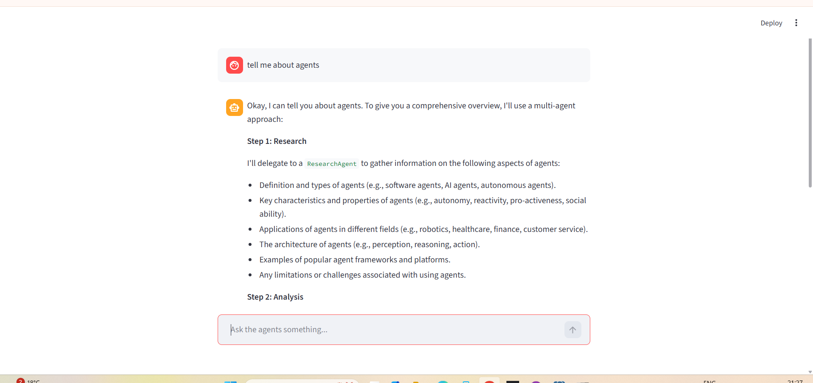

# Multi-Agent AI Assistant using Google ADK, Gemini, FastAPI, and Streamlit

**Production-grade multi-agent AI system demonstrating Google ADK orchestration, tool-enabled reasoning, and scalable GenAI backend architecture.**

Built using the **Google Agent Development Kit (ADK)**, **Gemini LLM**, **FastAPI**, and **Streamlit**, this system simulates a collaborative AI team where specialized agents coordinate to research, analyze, and generate responses using structured workflows.

---

## 🚀 Live System Preview

### Streamlit Multi-Agent Interface
The Streamlit UI allows users to interact with the multi-agent system in real time. The **ManagerAgent** dynamically delegates tasks to specialized agents and presents structured responses.

### FastAPI Production Backend (Swagger UI)
The FastAPI backend exposes production-ready endpoints with session persistence and agent orchestration using Google ADK Runner and Session.

---

## 📸 Screenshots

### Streamlit Multi-Agent Interface


### FastAPI Swagger API


---

## 🧠 Agent Orchestration using Google ADK

This system uses Google ADK's core orchestration primitives:

- **Agent**: Defines specialized roles (Manager, Research, Analyst, Writer).
- **Runner**: Executes agent workflows.
- **Session**: Maintains conversation state across requests.
- **Tool**: Enables agents to interact with external functions.

The **ManagerAgent** coordinates sub-agents using ADK-native orchestration patterns, ensuring scalable and modular execution.

---

## ⚙️ Production-Ready Backend

The system is designed for production environments with:

- **Stateless FastAPI API layer**
- **Session-based agent state management**
- **Modular agent architecture**
- **Tool abstraction layer**
- **Docker-ready deployment**
- **Frontend-backend separation**

This architecture mirrors real-world GenAI backend systems used in modern AI startups.

---

## 🏗️ System Architecture

```mermaid
graph TD
    User((User)) -->|Input| Streamlit[Streamlit Frontend]
    Streamlit -->|API Request| FastAPI[FastAPI Backend]
    FastAPI --> Runner[Google ADK Runner]
    Runner --> Session[Session (State Management)]
    Session --> Manager[ManagerAgent (Orchestrator)]
    Manager -->|Delegates| Research[ResearchAgent]
    Manager -->|Delegates| Analyst[AnalystAgent]
    Manager -->|Delegates| Writer[WriterAgent]
    Research -->|Uses| Tools[Web Search / URL Reader]
    Writer -->|Generates| Response[Final Output]
    Response --> FastAPI
    FastAPI --> Streamlit
```

---

## 🔄 Agent Workflow Example

**User Query:**
> "Tell me about AI agents"

**Execution Flow:**
1.  **ManagerAgent** receives request.
2.  **ManagerAgent** delegates research task to **ResearchAgent**.
3.  **ResearchAgent** gathers structured information using tools.
4.  **ManagerAgent** sends results to **AnalystAgent**.
5.  **AnalystAgent** extracts key insights.
6.  **ManagerAgent** delegates final formatting to **WriterAgent**.
7.  **WriterAgent** generates final response.
8.  **Response** returned to user.

---

## ✨ Key Features

- **Production-grade multi-agent orchestration** using Google ADK.
- **Specialized agents** coordinated through ManagerAgent.
- **Tool calling capability** (search, calculator, URL reader).
- **Session-based conversation persistence** using ADK Session.
- **Gemini LLM integration** for intelligent reasoning.
- **FastAPI backend** for scalable deployment.
- **Streamlit frontend** for real-time interaction.
- **Modular, scalable architecture**.
- **Docker-ready deployment**.

---

## 🧩 Skills Demonstrated

- **Multi-agent system architecture**
- **Google ADK orchestration**
- **LLM tool calling integration**
- **Backend system design with FastAPI**
- **Session-based state management**
- **Production-ready API development**
- **Scalable GenAI system design**

---

## 🛠️ Tech Stack

- **Python**
- **Google Agent Development Kit (ADK)**
- **Gemini LLM**
- **FastAPI**
- **Streamlit**
- **ChromaDB** (Memory Layer)
- **Docker**

---

## 📂 Project Structure

```bash
multi-agent-adk-assistant/
├── api/                # FastAPI application and endpoints
├── agents/             # ADK Agent definitions (Manager, Research, Analyst, Writer)
├── tools/              # Custom tools implementation
├── memory/             # Vector store integration
├── llm/                # Gemini configuration
├── core/               # App configuration
├── google/             # ADK implementation
├── ui/                 # Streamlit frontend app
├── requirements.txt    # Project dependencies
├── Dockerfile          # Docker build instructions
└── README.md           # Project documentation
```

---

## 🔌 API Example

**Endpoint:** `POST /chat`

**Request:**
```json
{
  "message": "Explain multi-agent systems"
}
```

**Response:**
```json
{
  "response": "Multi-agent systems consist of specialized agents collaborating..."
}
```

---

## 💻 Installation & Setup

1.  **Clone repository:**
    ```bash
    git clone https://github.com/aastha2006/multi-agent-adk-assistant
    cd multi-agent-adk-assistant
    ```

2.  **Create virtual environment:**
    ```bash
    python -m venv venv
    # Windows:
    .\venv\Scripts\activate
    # Linux/Mac:
    source venv/bin/activate
    ```

3.  **Install dependencies:**
    ```bash
    pip install -r requirements.txt
    ```

4.  **Configure Environment:**
    ```bash
    cp .env.example .env
    # Add your Google Gemini API Key to .env
    ```

5.  **Run FastAPI Backend:**
    ```bash
    uvicorn api.main:app --reload
    ```
    Access Swagger UI at: [http://localhost:8000/docs](http://localhost:8000/docs)

6.  **Run Streamlit Frontend:**
    (Open a new terminal)
    ```bash
    python -m streamlit run ui/app.py
    ```

---

## 💡 Why this project is important

Modern AI systems use agent orchestration to break complex tasks into smaller specialized workflows. This project demonstrates how to build scalable, production-ready multi-agent systems using Google's official ADK.

---

## 👨‍💻 Author

**Aastha Bhati**  
AI Engineer | GenAI | Backend Systems

- **GitHub:** [https://github.com/aastha2006](https://github.com/aastha2006)
- **LinkedIn:** [https://linkedin.com/in/aastha-bhati-583a50197](https://linkedin.com/in/aastha-bhati-583a50197)
